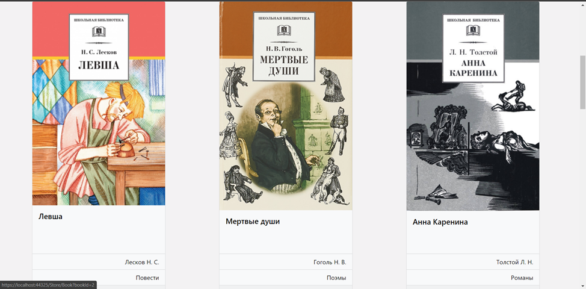
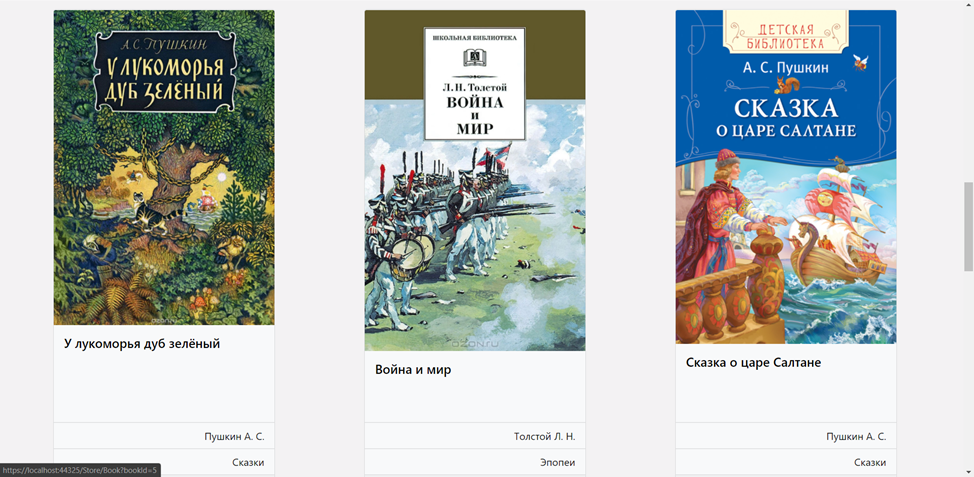
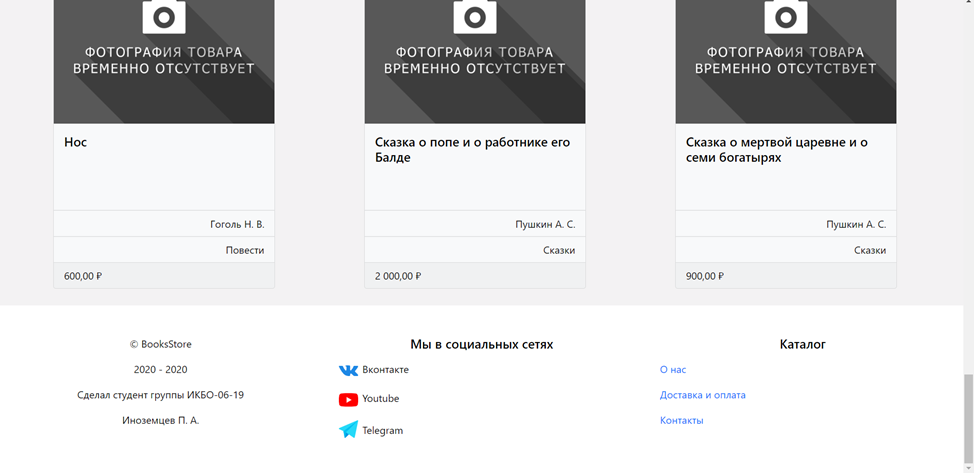
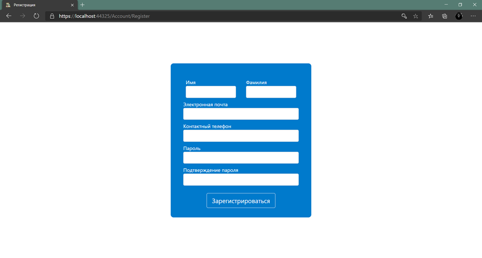
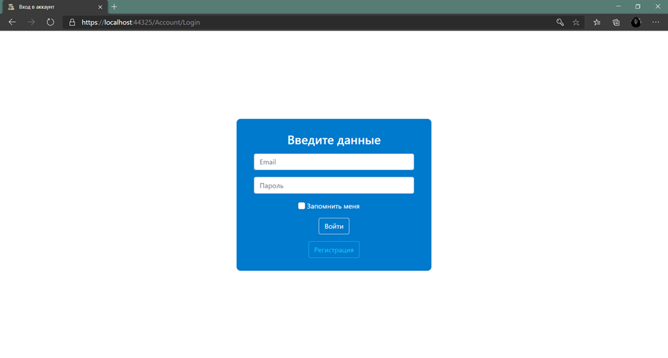
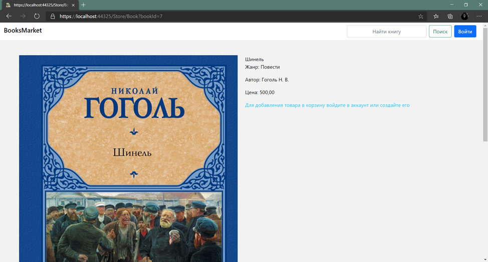
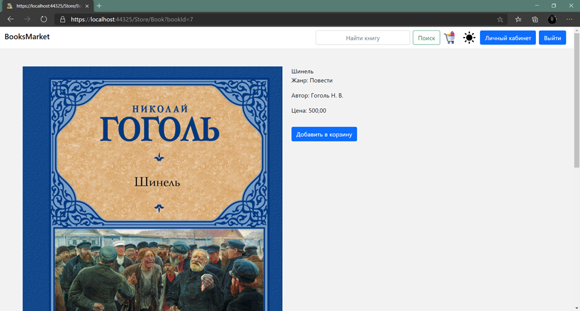
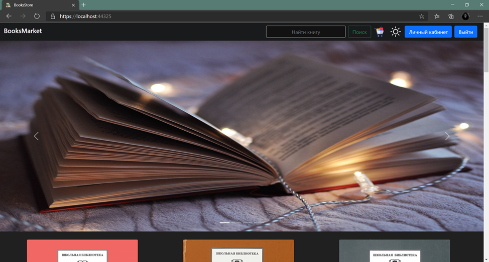
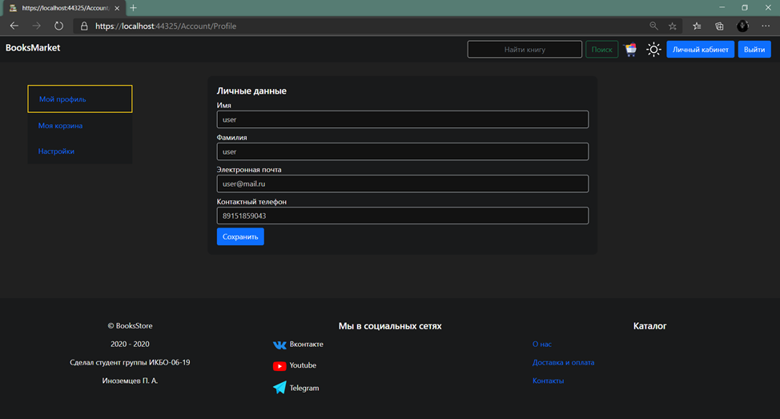

# Books store MVC
This is my first ASP.NET the project.
In this project, I created a bookstore where users could view a list of products,
then create an account for themselves or log in with their username.
Everyone could add an item to their shopping cart and then make a purchase.

| Name   | Status |
| ------ | ------ |
| Build  |  |
| Tests  |  |

## Site images
### Main page

### Registration page

### Login page

### Product page

### Product page for authorized user

### Dark theme

### Personal account page

## Project technologies stack

Database

- [Microsoft SQL Server 2019](https://www.microsoft.com/ru-ru/sql-server/sql-server-2019)

ORM

- [Entity Framework Core](https://www.nuget.org/packages?q=postgre)

### Tests
- [xUnit](https://github.com/xunit/xunit)
- [Moq](https://github.com/moq/moq4)

### Patterns
- Repository
- MVC